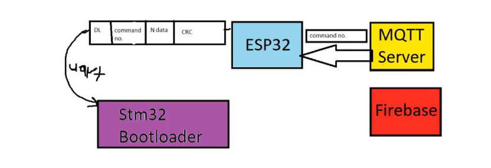

# STM32 FOTA Project

## 📌 Overview
This project implements a **Firmware Over-The-Air (FOTA)** system that enables
remote firmware updates for embedded systems.

## 🧠 System Architecture

## 🔧 Technologies Used
- **STM32** – Custom bootloader
- **ESP32**
- **MQTT**
- **Node-RED**

## ⚙️ Key Features
- STM32 bootloader implementation
- Flash memory erase and write
- Remote firmware update
- Secure MQTT communication

## 🎯 Objective
Improve **maintenance and scalability** of IoT systems without physical access.

## 📂 Source Code
🔗 [GitHub Repository](https://github.com/yourusername/stm32-fota-project)

## 🚀 What I Learned
- Bootloader design on STM32
- Flash memory management
- IoT communication using MQTT
- OTA system architecture

## 🔮 Future Improvements
- Firmware encryption
- Version management
- Rollback mechanism
