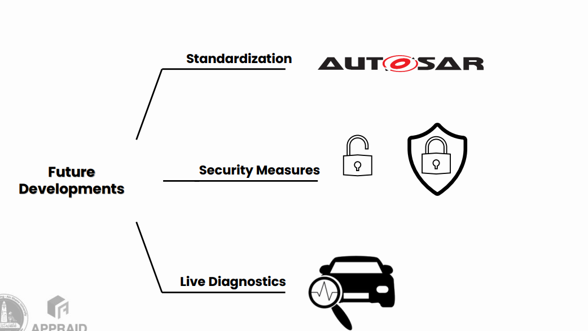

# STM32 FOTA Project

## 📌 Overview
This project demonstrates a robust **Firmware Over-The-Air (FOTA)** update mechanism for embedded systems.  
It enables developers to remotely update the firmware of an STM32-based device through a cloud interface, eliminating the need for physical **ST-Link / JTAG** connections.

The system is designed with reliability, safety, and scalability in mind, following real-world embedded and IoT constraints.

---

## 🧠 System Architecture
The system follows a **Gateway–Node architecture**:

1. **Management Console (Node-RED)**  
   Provides a graphical dashboard where the user uploads the firmware `.bin` file and triggers the update via MQTT.

2. **Connectivity Bridge (ESP32)**  
   Acts as an internet gateway. It receives update commands, downloads the firmware in chunks, and forwards them to the STM32.

3. **Target Device (STM32)**  
   Receives the firmware via UART, verifies its integrity, and writes it into internal Flash memory using a custom Bootloader.

  

---

## 🔧 Technical Deep Dive

### 1️⃣ Memory Mapping (STM32)
The internal Flash memory is carefully partitioned to guarantee system stability and safe updates:

- **Sector 0 (0x0800 0000)**  
  Bootloader – Startup code, command parser, and update decision logic.

- **Sector 1 (0x0800 4000)**  
  Bootloader – Flash erase/write routines, CRC verification, and jump-to-application logic.

- **Application Area (from 0x0800 8000)**  
  Main user firmware.

- **Flags / Metadata Section**  
  Stores update status, firmware version, and integrity information.

  

> ⚠️ The Bootloader region is protected and never overwritten during firmware updates.

---

### 2️⃣ Update Process (State Machine)

- **Idle** – Normal execution of the current application  
- **Download** – ESP32 receives firmware chunks via MQTT/HTTP  
- **Write** – STM32 enters Bootloader mode, erases application sectors, and writes new data  
- **Verification** – CRC-32 checksum validation  
- **Jump** – Bootloader sets the MSP and jumps to the new application reset handler  

This state-machine approach ensures deterministic behavior and prevents system corruption.

---

## 🔁 Boot Process & Control Logic
On every reset or power-up, the STM32 starts execution from the **Bootloader**.

The Bootloader:
1. Initializes minimal hardware (clock, UART).
2. Checks the update flag stored in Flash metadata.
3. If an update is requested, validates and programs the new firmware.
4. Otherwise, safely jumps to the existing application.

This guarantees that the device always boots into a valid and functional state.

---

## 🛡️ Firmware Integrity & Safety Mechanisms
To avoid bricking the device, multiple safety mechanisms were implemented:

- **CRC-32 verification** to detect corrupted firmware
- **Header validation** before any Flash erase operation
- **Fail-safe update logic** that preserves the Bootloader
- **Controlled jump** with MSP and reset handler verification

These protections ensure high reliability even in case of power loss or communication errors.

---

## 🌐 Communication Protocol & MQTT Topics
The system uses **MQTT** for lightweight and scalable communication.

**Data flow:**
1. Node-RED publishes an update command.
2. ESP32 subscribes and downloads the firmware.
3. Firmware chunks are sent to STM32 via UART.
4. STM32 replies with ACK/NACK and progress updates.

---

## 🖥️ Node-RED Dashboard
Node-RED provides a user-friendly interface with:
- Firmware upload (.bin)
- Update trigger button
- Real-time progress display
- Status feedback (Idle, Writing, Success, Error)

This allows safe firmware deployment even by non-technical users.

  

---

## ⚙️ Technologies & Protocols

| Component        | Technology                    | Role |
|------------------|-------------------------------|------|
| Microcontroller | STM32 (ARM Cortex-M)           | Main execution & Flash management |
| Connectivity    | ESP32                          | Wi-Fi & MQTT stack |
| Cloud / UI      | Node-RED + MQTT Broker         | Firmware deployment dashboard |
| Communication   | UART                           | ESP32 ↔ STM32 data transfer |
| Language        | C (HAL / LL Drivers)           | Low-level firmware development |

---

## ⚙️ Key Features
- [x] **Custom Bootloader** with vector table relocation and safe jump  
- [x] **Fail-safe Flash erasure** based on firmware validation  
- [x] **Chunk-based transfer** supporting large firmware sizes  
- [x] **Real-time update progress** via Node-RED dashboard  

---

## 📂 Source Code
🔗 [GitHub Repository](https://github.com/yourusername/stm32-fota-project)

---

## 🚀 What I Learned
- STM32 boot process and memory mapping
- Bootloader design and Flash management
- IoT communication using MQTT
- End-to-end OTA system architecture

---

## 🔮 Future Developments

  

---

## 🏁 Conclusion
This project provided hands-on experience in building a **real-world FOTA system**
combining embedded firmware, IoT communication, and cloud-based management.

It reflects industrial constraints such as reliability, safety, and scalability,
and represents a solid foundation for future work in **embedded systems and IoT engineering**.
